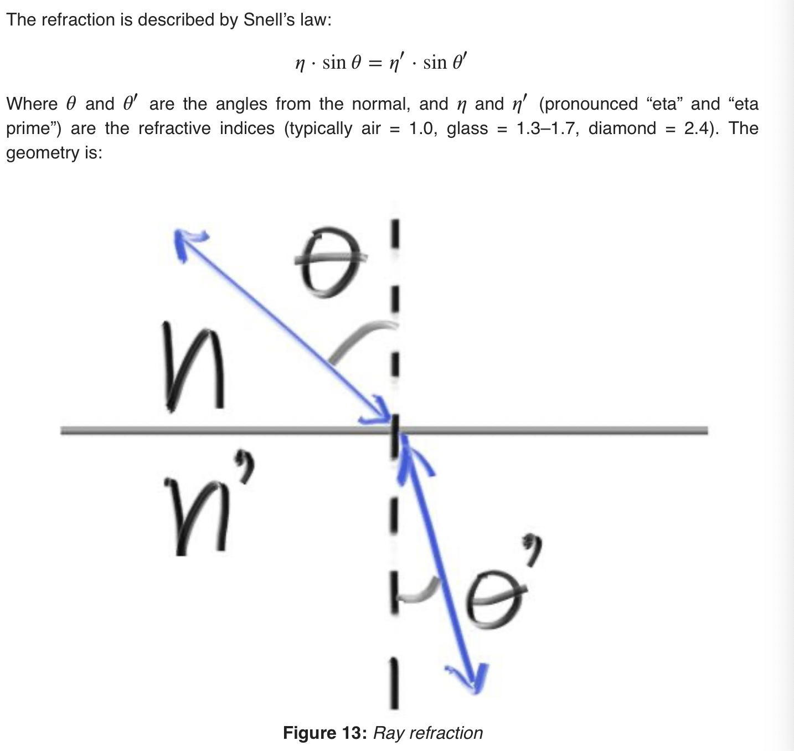

# Sources
- [Ray Tracing Weekend](https://raytracing.github.io/books/RayTracingInOneWeekend.html)

# Conventions

### Coordinate System
- Right hand coordinate system, `-z` runs into the screen
- `+x`: to the right
- `+y`: up
- `+z`: out of the screen (towards you) 

### Surface Normals
- Always point in the opposite direction of the incident ray
- Allows us to determine the side of the surface at the time of geometry intersection (rather
  than at the time of coloring)

# Basic Steps
1. Calculate the ray from the eye to the pixel.
2. Determine which objects the ray intersects.
3. Compute the color for that intersection point.

# Definitions
- `focus length`: Distance between the projection plane and the projection point 
- `antialiasing`: Sending rays through multiple points inside a pixel to get an average color
- `gamma correction`: transforming a value in the range [0, 1] before storing in (as bytes)
- `shadow acne`: Undesirable featured caused by floating point approximations
  - eg: rays intersecting at `t = -0.0000001` or `t = 0.0000001` rather than exactly `t = 0` 
- `True Lambertian Reflection`: Reflections where the reflected rays have a uniform distribution of cos(\theta), \theta
  being the angle between the reflected ray and the (outer) surface normal. 
  - Can be achieved by targeting bounced rays at random points along the surface of a unit sphere
    - Picking such points can be done by picking random points _inside_ a unit sphere and then normalizing them
- `diffuse reflection`: reflection such that a ray incident on the surface is scattered at many angles rather than just
  one angle (as is the case in specular reflection)
- `ideal diffuse reflection`: When a surface exhibits *Lambertian* reflection, meaning that there is equal
  luminance when viewed from all directions lying (in the half-space) adjacent to the surface 
- `Snell's Law`: 
- `Dielectric material`: A transparent material that reflects as well as refracts light
- `Total Internal Reflection`: When a ray is _inside_ a material with a higher refractive index than the material on the outside, resulting in no possible solutions to Snell's Law, the ray reflects. 
- `Focus distance`: Distance between the projection point and the plane where everything is in perfect focus
- `Perfect focus`: When the `focus distance` is equal to the `focus length`

# Creating Gradients with Interpolation

# Vector Operations

### Subtracting Vectors
- let `P = Vec3(A, B, C)`
- let `C = Vec3(D, E, F)`
- Therefore, `P - C` is the vector from point `C` to point `P`

# Ray-Sphere Intersection

### Determining the Location of the Ray Based on a Surface Normal
- If the `ray` and the `normal` point in the same direction, the ray
  is coming from within the object
- Otherwise, the ray is coming from outside of the object
- This can be determined by taking the dot product of the two vectors

# 9.6
